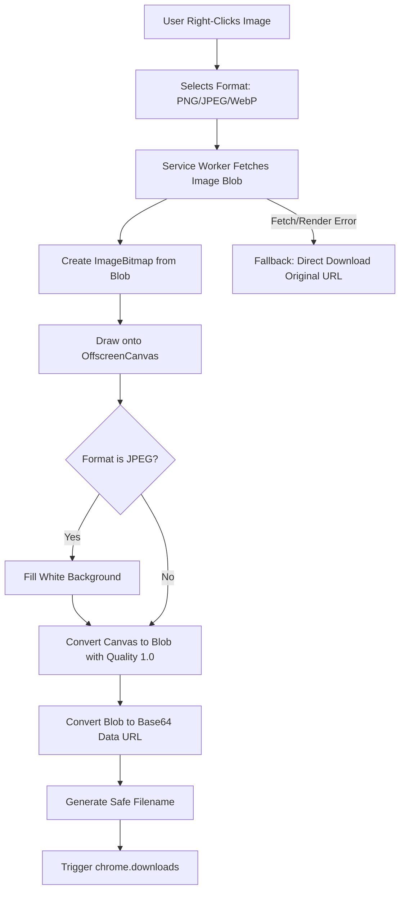

# Save Image as JPEG Pro

A lightweight and efficient Chrome extension that lets you effortlessly convert and save any web image as a maximum-quality JPEG, PNG, or WebP at its original natural resolution.

**Developer:** Fatai Ayeloja

---

## Features

- **Right-Click Context Menu Integration:** Seamlessly adds a parent option `"Save Image As..."` with child options for **PNG**, **JPEG**, and **WebP** to your right-click context menu when hovering over images.
- **High-Quality Conversion:** Uses browser-native APIs (`createImageBitmap` and `OffscreenCanvas`) to process image pixels at their natural dimensions, ensuring no loss of detail.
- **Transparency Handling:** Automatically fills transparent areas with a clean white background when converting images to JPEG format.
- **Maximum Quality (1.0 Quality):** Converts and encodes images to JPEG and WebP at maximum quality factor (`1.0`) for pristine fidelity.
- **Smart Filename Generation:** Parses image URLs and query parameters to generate a clean, safe, and descriptive filename for the downloaded file.
- **Resilient Fallback Mechanism:** In case canvas rendering or conversion fails (e.g., due to CORS or secure resources), the extension fallback triggers a direct download of the original image so you never lose the file.

---

## Technical Details & Architecture

The extension is built using **Chrome Extension Manifest V3** and runs entirely within a service worker (`background.js`). It requires no popup UI, keeping it extremely light on resources.

### Tech Stack
- **Manifest V3**
- **Vanilla JavaScript (ES6+)**
- **Offscreen Canvas API** for background image manipulation and conversion.
- **Chrome APIs:** `chrome.contextMenus`, `chrome.downloads`, and `chrome.runtime`.

### Flow of Operation



---

## Installation & Setup

To load this extension locally into Google Chrome (or any Chromium-based browser):

1. **Clone or Download** this repository to your local machine.
2. Open Google Chrome and navigate to the Extensions management page by typing:
   ```
   chrome://extensions/
   ```
3. Enable **Developer mode** using the toggle switch in the top-right corner of the page.
4. Click the **Load unpacked** button in the top-left corner.
5. Select the project directory (`fatai-save-as-jpeg`) containing the `manifest.json` file.
6. The extension is now installed and active! You can test it by right-clicking any image on the web.

---

## Permissions & Security

The extension requests the minimum set of permissions necessary to function safely:

- **`contextMenus`:** Required to inject the "Save Image As..." options into the browser's right-click context menu.
- **`downloads`:** Required to trigger the browser download dialog for the newly converted image.
- **`<all_urls>` (Host Permission):** Required to fetch the image data bytes over the network using extension privileges to allow conversion (handles CORS-enabled images). All image processing occurs locally on your machine; no image data is sent to external servers.

---

## License

This project is open-source and free to use.
