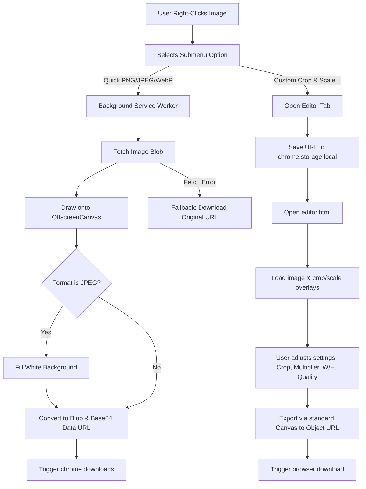

# FImgSave Pro

A lightweight, premium Chrome extension that lets you effortlessly crop, scale, convert, and save any web image as a high-quality PNG, JPEG, or WebP at its original resolution or custom dimensions.

**Developer:** Fatai Ayeloja

---

## Features

- **Right-Click Context Submenu:** Hover over any web image, select `"Save Image As..."`, and click a target format (**PNG**, **JPEG**, or **WebP**) to download it instantly.
- **Interactive Visual Editor:** Click `"Custom Crop & Scale..."` to open a full-featured, dark-themed image workshop where you can:
  - **Crop & Align:** Use a visual crop box overlay with rule-of-thirds grid guides.
  - **Aspect Ratio Locking:** Choose between presets like **Free**, **1:1 (Square)**, **16:9**, **4:3**, and **2:3**.
  - **Upscaling / Resizing:** Use the scale slider (from 0.25x to 4x) or type custom width/height values manually (maintaining aspect ratio).
  - **Export Control:** Select format and configure the quality factor (10% to 100%) for JPEG and WebP.
  - **Custom Filenames:** Edit the output filename before saving.
- **Modern Canvas Processing:** Uses browser-native APIs (`createImageBitmap` and `OffscreenCanvas`) in the service worker for quick downloads, and standard canvases for the editor page, ensuring maximum performance.
- **Transparency Handling:** Automatically fills transparent regions with a white background when converting to JPEG to prevent black box artifacts, while preserving transparency for PNG and WebP.
- **Smart Filenames:** Dynamically extracts and cleans filenames from pathname structures or query parameters, and handles base64 data URLs.
- **Resilient Fallback:** If canvas processing fails (e.g., due to CORS restrictions), it automatically falls back to downloading the original image directly.

---

## Technical Details & Architecture

The extension is built using **Chrome Extension Manifest V3**. It handles quick saves directly inside a service worker (`background.js`) to conserve browser memory, and spawns a tabbed application (`editor.html`) for interactive processing.

### Tech Stack
- **Manifest V3**
- **Vanilla JavaScript (ES6+)**
- **Offscreen Canvas & standard HTML5 Canvas** for pixel transformations.
- **Google Fonts (Outfit & Inter)** for a premium design aesthetic.
- **Chrome Extension APIs:** `chrome.contextMenus`, `chrome.downloads`, `chrome.storage`, and `chrome.runtime`.

### Flow of Operation



---

## Installation & Setup

To load this extension locally into Google Chrome (or any Chromium-based browser):

1. **Clone or Download** this repository to your local machine.
2. Open Google Chrome and navigate to the Extensions management page by typing:
   ```
   chrome://extensions/
   ```
3. Enable **Developer mode** using the toggle switch in the top-right corner of the page.
4. Click the **Load unpacked** button in the top-left corner.
5. Select the project directory (`fatai-save-as-jpeg`) containing the `manifest.json` file.
6. The extension is now installed and active! You can test it by right-clicking any image on the web.

---

## Permissions & Security

The extension requests the minimum set of permissions necessary to function safely:

- **`contextMenus`:** Required to inject the "Save Image As..." options into the browser's right-click context menu.
- **`downloads`:** Required to trigger the browser download dialog for the newly converted image.
- **`storage`:** Required to pass data URLs and large image sources safely from the background service worker to the editor tab without hitting URL length limits.
- **`<all_urls>` (Host Permission):** Required to fetch the image data bytes over the network using extension privileges to allow conversion (handles CORS-enabled images). All image processing occurs locally on your machine; no image data is sent to external servers.

---

## License

This project is open-source and free to use.
